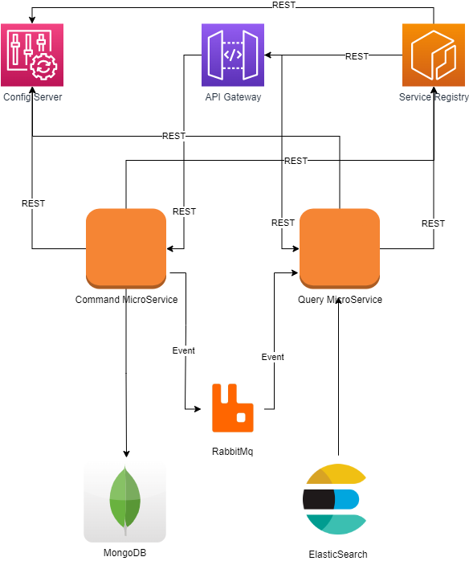
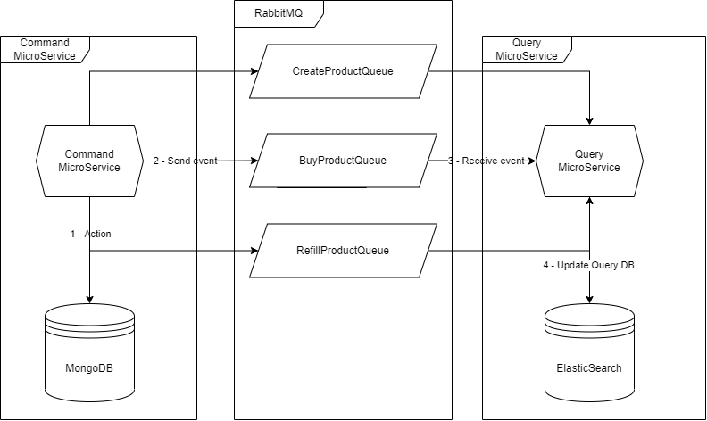
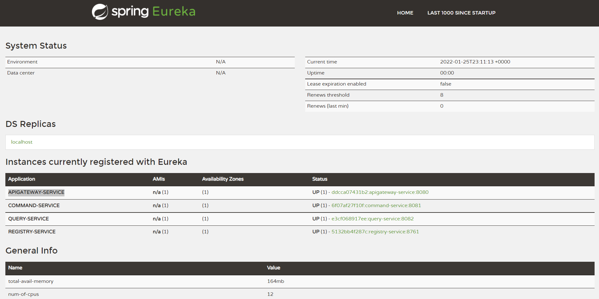

# MicroServices and CQRS

Greetings there!
<br>
Are you familiar with CQRS? Either way let me walk you through this project.

## What is CQRS?

__CQRS__ stands for __Command and Query Responsibility Segregation__, a pattern that separates read and update operations for a data store. Implementing CQRS in your application can maximize its _performance_, _scalability_, and _security_. The flexibility created by migrating to CQRS allows a system to better evolve over time and prevents update commands from causing merge conflicts at the domain level.

## Project architecture

<p align="center">
  
</p>

- __Config Service (Spring Cloud Config):__ The service that's going to provide the services config. The service configuration files are provided in the following [GitHub repository](https://github.com/hajali-amine/microservices-cqrs-configs).
- __Service Registry (Spring Eureka):__ The services will register themselves directly when it's up.
- __API Gateway (Spring Cloud Gateway):__ This will handle incoming requests and and redirects them to the corresponding registered internal services.
- __Command and Query Services:__ The famous MicroServices implementing CQRS.
- __RabbitMQ:__ The message broker that will allow us to synchronize between both databases by providing events.
- __MongoDB:__ Our command DB, the choice behind this type of database is because of how _fast writes_ are in it.
- __ElasticSearch:__ Our query DB, the choice behind this type of database is because of how _fast reads_ are in it.

## A closer look on our MicroServices

<p align="center">
  
</p>

## Try it yourself!

It's easy! All you have to do is open your terminal in the root of the project and use the following command.
``` console
aminehajali@cqrs:~/cqrs-microservices$ docker-compose build
aminehajali@cqrs:~/cqrs-microservices$ docker-compose up
```
Now, when you have started the project, you can check if your services have been registered or not by visiting:
> http://localhost:8761/

It should look something like this:


<p align="center">
  
</p>

If the services are all registered, now you can test it out!

One thing to mention, in this project we're dealing with a sole entity __Product__.
``` json
"Product": {
    "ref": "str",
    "name": "str",
    "description": "str",
    "price": "float",
    "quantity": "int"
}
```

__Commands:__

| Command        | Method           | Request | Body |
| ------------- |:-------------:| ------------------ | ---------- |
| Create Product     | Post | localhost:8080/command/create | Product object |
| Buy Product   | Post | localhost:8080/command/buy/_{product-ref}_ | Nothing |
| Refill Product | Post | localhost:8080/command/refill/_{product-ref}_?quantity=_{quantity}_ | Nothing |

__Query:__

| Query        | Method           | Request |
| ------------- |:-------------:| ------------------ |
| Get All Products     | Get | localhost:8080/query/ |
| Get Product By Reference   | Get | localhost:8080/query/_{product-ref}_ |

> If you want to purge both databases, just call the following Delete requests:

> localhost:8080/query/purge

> localhost:8080/command/purge

## Thank you for your attention and don't forget to leave a ⭐